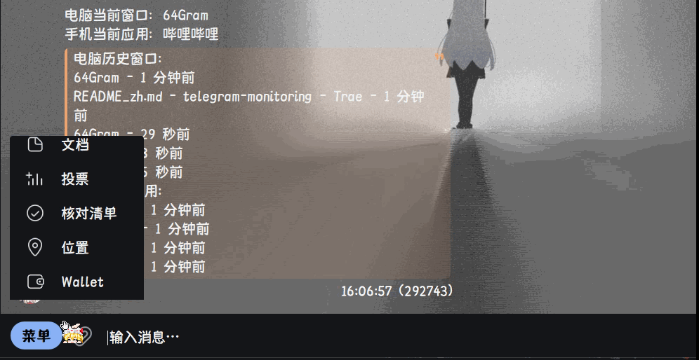
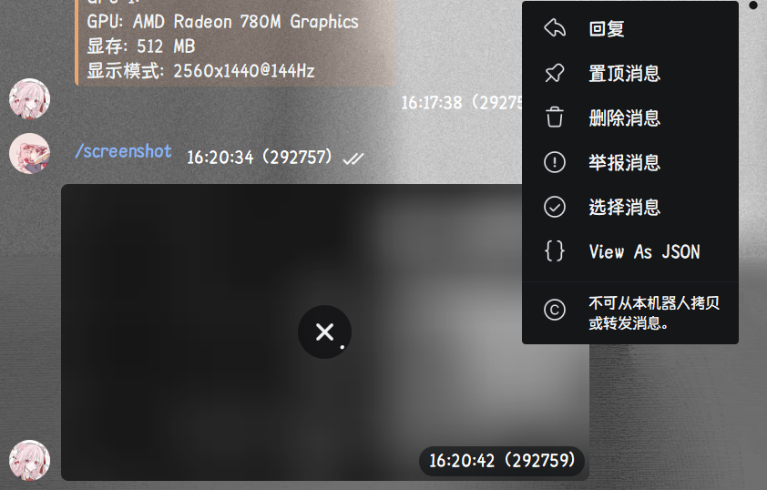
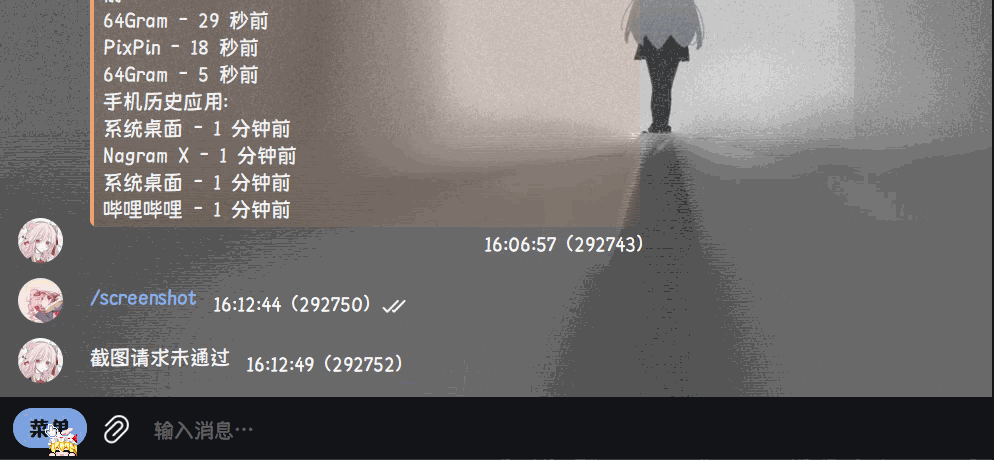
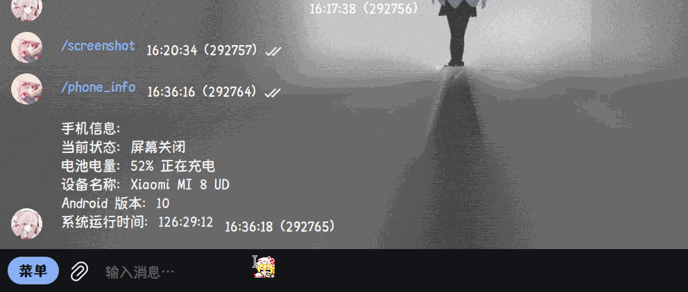

# Telegram Monitoring[^1]

---

用于让别人知道你电脑和手机的前台窗口/应用的Bot，也可以仅作为API（不使用 Telegram 功能）

服务端可在 Windows/macOS/Linux 运行

客户端仅支持 Windows10/11、Android 6.0 及以上系统

---

## 运行

### 服务端

#### 使用 [uv](https://github.com/astral-sh/uv)

```bash
# 安装依赖
uv sync

# 直接运行
uv run main.py

# 或不使用bot，仅作为API
uv run main.py --nobot
```

#### 使用本机 Python

```bash
# 建议先创建虚拟环境
python -m venv .venv
# 然后激活它（Windows）：
.venv\Scripts\activate
# 或者（macOS/Linux）：
source .venv/bin/activate

# 安装依赖
pip install -r requirements.txt
python main.py

# 或不使用bot，仅作为API
python main.py --nobot
```

首次运行时会创建 config.yaml 配置文件和 API token，token 会打印在控制台

如果你认为 token 已被泄露，可以运行 `python generate_token.py` 来重新生成 token（会自动写入 config.yaml，运行它需要先激活虚拟环境并安装依赖）

---

### 客户端

#### Windows

在项目的 Release 页面下载最新版本的客户端，第一次运行会生成配置文件，根据服务端的配置填写 token 等信息
客户端仅支持 x86 架构的 Windows10/11 系统
暂不清楚是否支持 arm64 架构的 Windows 系统，如果你正好有 arm64 架构的 Windows 系统
可以尝试运行：

```bash
# 确保你已安装 uv
uv sync --dev
uv run client.py
```

如果 arm64 架构运行出现问题，请提 issue 反馈

#### Android（非必须）

安装 [MacroDroid](https://play.google.com/store/apps/details?id=com.arlosoft.macrodroid)

下载 Release 页面中的 `monitoring.macro` 并导入进 MacroDroid 中

你仅需要更改所有 `HTTP 请求 (POST)` 动作

如果你做过反向代理，则可以将 `http` 更改为 `https`

将 `ip` 替换为你服务器的IP或域名

将 `port` 替换为你在服务端配置文件中设置的端口（若有端口映射则填写端口映射后的端口）
可为空，仅需删除 `:port` (包括冒号) 即可（默认端口由协议决定，`http` 为 80，`https` 为 443）

在请求头参数中的 `your_token` 改成服务端生成的token即可

剩下的 `HTTP 请求 (POST)` 动作也一样更改

最后关闭 MacroDroid 的电池优化并常驻后台即可

---

## 配置说明

### 服务端

```yaml
bind: 0.0.0.0 # 监听地址，默认 0.0.0.0 表示监听所有地址
lang: zh_CN # 语言，默认 zh_CN 表示中文
log_level: INFO # 日志级别，可输入 DEBUG, INFO, WARNING, ERROR, CRITICAL，默认 INFO
max_window: 5 # 最大记录窗口标题的个数
port: 5000 # 监听端口，默认 5000
telegram: # telegram 相关配置，不使用可忽略
  admins: # 管理员用户ID列表，默认空列表表示不启用管理员功能
  - 123456789
  screenshot:
    allow: true # 是否允许截图，默认 true
    delete_time: 3 # 截图删除时间，单位秒，默认 3 秒
  token: "" # Telegram Bot token，必须。否则无法启动
token: "" # API token，会自动生成
```

### 客户端

```yaml
lang: zh_CN # 语言，默认 zh-CN 表示中文
log_level: INFO # 日志级别，可输入 DEBUG, INFO, WARNING, ERROR, CRITICAL，默认 INFO
chat_mode: false # 是否启用聊天模式，默认 false
pass_window: # 要过滤的窗口标题列表，如不懂可保持默认值
  - 任务切换
  - 新通知
server_url: http://localhost:5000 # 服务端URL，默认 http://localhost:5000，填写服务端IP和可用于连接的端口
token: '' # API token，填写服务端生成的 token
```

---

## 使用

### Telegram

#### 基本使用

- `/start` 注册到数据库中
- `/ping` 获取客户端当前前台窗口和历史窗口以及手机当前应用和历史应用
- `/screenshot` 在客户端截图并发送（仅电脑）
- `/info` 获取客户端硬件信息（仅电脑）
- `/phone_info` 获取手机信息（仅手机）
- `/ban` 封禁用户
- `/unban` 解封用户
- `/add` 添加允许用户
- `/del` 移除允许用户
- `/list` 查看已注册用户列表
- `/allowlist` 查看允许用户列表
- `/banlist` 查看封禁用户列表

#### 功能演示

激活机器人并获取客户端窗口信息:


请求客户端的截图:



接收的客户端截图被视为无法转发，如图:



如果通知自然消失或手动将通知移到控制中心，则视为不允许截取当前画面:


如果用户在允许列表中，则可以直接截取画面而无需经过允许

获取客户端硬件信息:


关于电池电量：0% 则视为台式机或无电池笔记本；充电状态为“直接供电”，95% 及以上视为智能充电

获取手机信息:


向客户端发送消息，客户端可以回复发消息的人:


刷屏或触发违禁词都将直接封禁

聊天模式:


### API

API均需要验证，来自配置文件中的 token

#### Socket.IO 实时获取

可以通过 `auth` 参数来验证
但需要额外增加验证或传入自定义请求头 `type` 为 `listen_client` 来连接
或者使用查询参数 `?type=listen_client`
示例代码：

```python
import socketio

sio = socketio.Client()
sio.connect(
  'http://localhost:5000',
  auth={'token': 'your_token', 'type': 'listen_client'}
)
```

node.js 示例代码：

```javascript
const socket = io('http://localhost:5000', {
  auth: {
    token: 'your_token',
    type: 'listen_client'
  },
});
```

如果你不懂这方面，可转到 [HTTP API](#http-api) 使用

- 事件名： `get_window`
  需要监听：是
  是否需要返回数据：不需要
  示例返回JSON:

  ```json
  {
    "now_window": "http://127.0.0.1:5000 - 1 - Azusa-mikan's Workspace",
    "switch_window_time": 1764411151,
    "window_list": [
        {
            "title": "http://127.0.0.1:5000 - 1 - Azusa-mikan's Workspace",
            "switch_window_time": 1764411075
        },
        {
            "title": "README_zh.md - telegram-monitoring - Trae",
            "switch_window_time": 1764411076
        },
        {
            "title": "http://127.0.0.1:5000 - 1 - Azusa-mikan's Workspace",
            "switch_window_time": 1764411077
        },
        {
            "title": "README_zh.md - telegram-monitoring - Trae",
            "switch_window_time": 1764411078
        },
        {
            "title": "http://127.0.0.1:5000 - 1 - Azusa-mikan's Workspace",
            "switch_window_time": 1764411151
        }
    ]
  }
  ```

- 事件名： `get_app`
  需要监听：是
  是否需要返回数据：不需要
  示例返回JSON:

  ```json
  {
    "name": "哔哩哔哩",
    "status": "应用程序打开 (所有应用程序)",
    "battery": "73",
    "power_status": "未充电",
    "device_info": "Xiaomi MI 8 UD",
    "android_version": "10",
    "uptime": "130:31:14",
    "switch_app_time": 1764419892,
    "app_list": [
        [
            "系统桌面",
            1764419878
        ],
        [
            "哔哩哔哩",
            1764419892
        ]
    ]
  }
  ```

#### HTTP API

请求头需为 `Authorization: Bearer your_token`
否则返回 `401 Unauthorized`

- `GET` `/now_window`
  返回类型： `application/json`
  示例返回JSON：[和上面一样](#socketio-实时获取)

- `GET` `/now_app`
  返回类型： `application/json`
  示例返回JSON：[和上面一样](#socketio-实时获取)

注：switch_window_time 和 switch_app_time 为 unix 时间戳，需要自己转换

### 技术细节

#### 使用的库

##### 服务端

- [aiosqlite](https://github.com/omnilib/aiosqlite) —— 用于用户存储

- [colorlog](https://github.com/borntyping/python-colorlog) —— 用于彩色日志

- [pydantic](https://github.com/pydantic/pydantic) —— 用于配置验证和json验证

- [pytelegrambotapi](https://github.com/eternnoir/pyTelegramBotAPI) —— 用于连接 Telegram

- [python-socketio](https://github.com/miguelgrinberg/python-socketio) —— 用于实现 Server - Client 架构

- [pyyaml](https://github.com/yaml/pyyaml) —— 用于加载配置

- [quart](https://github.com/pallets/quart) —— 用于提供 HTTP API

- [telegram-markdown-converter](https://github.com/ngoldo/telegram-markdown-converter) —— 用于转义 MarkdownV2 不接受的字符

- [uvicorn](https://github.com/Kludex/uvicorn) —— 用于启动

##### 客户端

- [aiohttp](https://github.com/aio-libs/aiohttp) —— `python-socketio[client]` 需要此库

- [aiotools](https://github.com/achimnol/aiotools) —— 用于聊天功能输入

- [mss](https://github.com/BoboTiG/python-mss) —— 用于截屏

- [pillow](https://github.com/python-pillow/Pillow) —— 用于图像处理

- [psutil](https://github.com/giampaolo/psutil) —— 用于获取系统信息

- [python-socketio[client]](https://github.com/miguelgrinberg/python-socketio) —— 与 `python-socketio` 配套

- [pywin32](https://github.com/mhammond/pywin32) —— 用于获取前台窗口标题

- [win11toast](https://github.com/GitHub30/win11toast) —— 用于通知

#### 项目引用

- [违禁词列表](https://telegra.ph/%E8%BF%9D%E7%A6%81%E8%AF%8D%E5%88%97%E8%A1%A8-11-21) —— 来自 [ZGQ Inc.](https://github.com/ZGQ-inc)

---


---

## 许可证

本项目采用 [AGPL-3.0](LICENSE) 许可证，允许非商业性使用，转载时请注明原作者与来源。

---

此项目以前就用 GPT-4o vibe coding 过（未公开），现在自己完全重写了一个，并且比原版加入了很多扩展功能

[^1]: 名字灵感来源于 [DECO*27 - モニタリング](https://www.bilibili.com/video/BV1qDUPYKEzf)